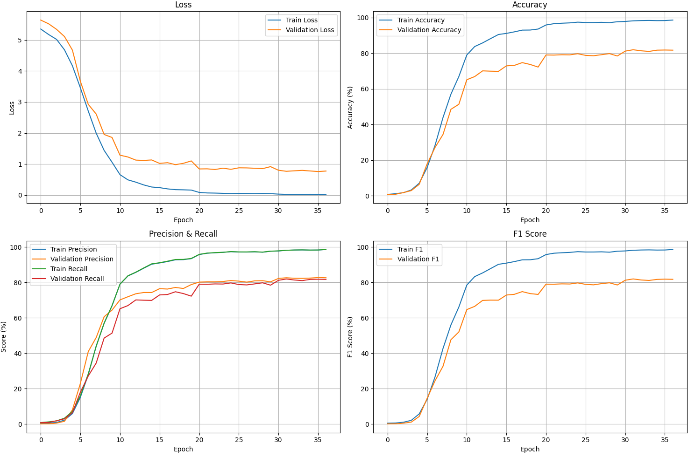

# 🚗 Car Model Recognition Report

> **Objective:** Build a high-performance deep learning system to classify **209 car models** from images — ideal for fleet management, security, and visual search applications.

---

## 🔍 1. Pipeline Overview

| Stage                | Description                                                                                                                                                     |
| -------------------- | --------------------------------------------------------------------------------------------------------------------------------------------------------------- |
| **Data Preparation** | Merge **Iran (13 classes)** & **Stanford (196 classes)**; resize to **400×400**, normalize; extensive augmentation (rotation, crop, flip, brightness/contrast). |
| **Model Design**     | **ResNet-18** backbone (pretrained, fine-tuned) + **2× CBAM** attention blocks (post-`layer2`/`layer3`); head: GAP → FC(209) → Softmax.                         |
| **Training**         | Weighted Cross-Entropy + WeightedSampler; **Adam** (lr=1e-3, wd=1e-5); LR ↓×0.5 every 10 epochs; early stop (5 epochs); batch=32; epochs=40; multi-GPU (2× T4). |
| **Evaluation**       | Metrics: Loss, Accuracy, Precision, Recall, F1-score on test set; visualize train/val curves.                                                                   |
| **Deployment**       | Export model & inference script; provide REST API for image upload and prediction.                                                                              |

---

## 📊 2. Dataset Details

|       Source | Classes | Train Images | Test Images | Total Images |
| -----------: | ------: | -----------: | ----------: | -----------: |
|     **Iran** |      13 |        6,809 |       1,474 |        8,283 |
| **Stanford** |     196 |        8,144 |       8,041 |       16,185 |
| **Combined** | **209** |   **14,953** |   **9,515** |   **24,468** |

> *Diverse makes, angles & lighting scenarios ensure robust learning.*

---

## 🏗️ 3. Model Architecture

```plaintext
Input (400×400×3)
│
├─ ResNet-18 Backbone (pretrained)
│   ├─ layer1
│   ├─ layer2 ──► CBAM Block
│   ├─ layer3 ──► CBAM Block
│   └─ layer4
│
├─ Global Average Pooling
└─ Fully Connected (209) + Softmax
```

* **Params:** \~11.3M • **Activation:** ReLU

---

## ⚙️ 4. Training Configuration

| Parameter          | Value                            |
| ------------------ | -------------------------------- |
| Optimizer          | **Adam**                         |
| Learning Rate (lr) | 1×10⁻³                           |
| Weight Decay (wd)  | 1×10⁻⁵                           |
| Batch Size         | 32                               |
| Epochs             | 40                               |
| LR Scheduler       | ×0.5 every 10 epochs             |
| Early Stopping     | 5 epochs patience                |
| Class Imbalance    | Weighted Cross-Entropy & Sampler |
| Hardware           | 2× Tesla T4 GPUs (CUDA)          |
| Framework          | PyTorch                          |

---

## 📈 5. Training & Validation Curves


*Loss, Accuracy, Precision, Recall, and F1-score trends over training and validation sets.*

---

## 🎯 6. Test Set Performance

|        Metric | Test Value |
| ------------: | ---------: |
|      **Loss** |     0.7763 |
|  **Accuracy** |     81.73% |
| **Precision** |     82.66% |
|    **Recall** |     81.73% |
|  **F1-score** |     81.75% |

> *Achieved strong classification across 209 models with attention and imbalance handling.*

---

